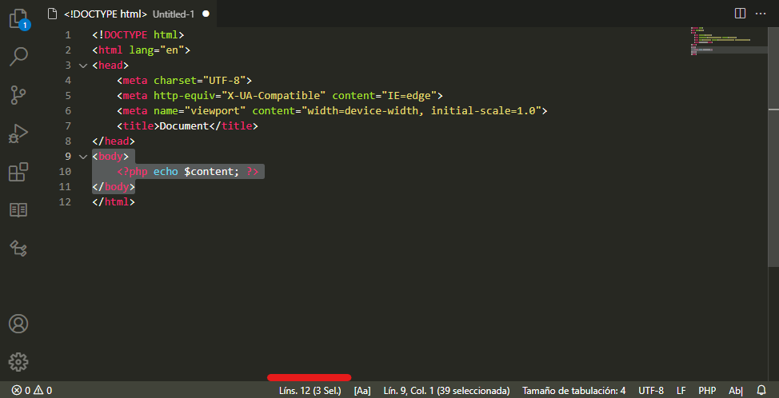
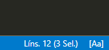
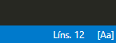

# Total Lines Info

Displays document total number of lines and total selected lines count in the status bar.

Selected lines count is displayed to the right of total lines, and is hidden if no lines are selected.

Selected lines count is compatible with multiselect.

You can customize the status bar output format in the extensions settings. E.g.: `Ln %d`

A number of lines can be set to let the extension display a warning or error background if the file exceeds the given limit. This may be helpful if you want to maintain the size of your code files under control.

Thanks to **akshit-arora** for this contribution.

## Extension Settings

This extension contributes the following settings:

* `linesinfostatusbar.alignment`: left/right, status bar item alignment
* `linesinfostatusbar.totalDisplayFormat`: Display format for the total lines count text, according to https://nodejs.org/api/util.html#util_util_format_format
* `linesinfostatusbar.selectedDisplayFormat`: Display format for the selected lines count text, according to https://nodejs.org/api/util.html#util_util_format_format
* `linesinfostatusbar.statusbarPriority`: number. Higher values means the info text items are displayed more to the left in the status bar
* `linesinfostatusbar.warningAtLineCount`: number. Show status bar background as warning when total lines exceed this number. If set to 0 (default), no change is applied to background.
* `linesinfostatusbar.errorAtLineCount`: number. Show status bar background as error when total lines exceed this number. If set to 0 (default), no change is applied to background.
