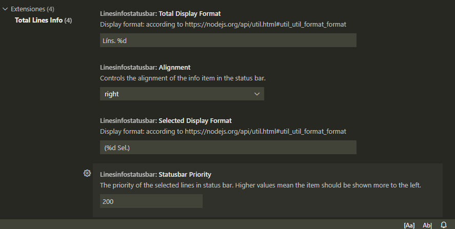

# linesinfostatusbar README

Displays document total number of lines and total selected lines count in the status bar.

## Features

Shows the total lines count and selected lines count in the status bar. The text for selected lines is displayed to the right of total lines, and is hidden if no lines are selected.

Selected lines count works with multiselect.

You can customize the status bar output in the extensions settings.

## Extension Settings

This extension contributes the following settings:

* `linesinfostatusbar.alignment`: left/right, status bar item alignment
* `linesinfostatusbar.totalDisplayFormat`: Display format for the total lines count text, according to https://nodejs.org/api/util.html#util_util_format_format
* `linesinfostatusbar.selectedDisplayFormat`: Display format for the selected lines count text, according to https://nodejs.org/api/util.html#util_util_format_format
* `linesinfostatusbar.statusbarPriority`: number. Higher values means the info text items are displayed more to the left in the status bar

## Release Notes

### 0.0.4
Added extension icon.
Added preview image.
Updated extension title.

### 0.0.2 
Fixed status bar item didn't hide when no editor was active.

### 0.0.1
Initial release.
Adapted from extensions:
- Show Line Count, by MPearon
- Select Line Status Bar, by tomoki1207
